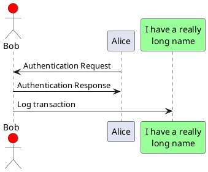

## README for UML Images to PlantUML Code Conversion

### Project Overview
This project showcases the development of a script leveraging Large Language Models (LLMs) such as GPT or Claude models to convert UML images into PlantUML code. The goal is to utilize vision models to interpret UML diagrams and translate them into the corresponding PlantUML code format.

### Tools and Technologies
- **Language Models**: GPT-4-turbo, GPT-3.5-turbo
- **Libraries**: OpenAI API, PIL, pytesseract
- **Formats**: Jupyter Notebook, Python script

### Achievements
- **Cost Efficiency**: Achieved a 50% cost reduction by strategically integrating GPT-3.5 with GPT-4-turbo.
- **Accuracy**: The correctness of the generated PlantUML code.
- **Expected Output**: Predcited output was nearly same as expected output.
- **Problem-Solving Process**: The approach and methodology used to achieve the solution.

### Problem Statement
The task is to develop a script that converts UML images to PlantUML code using vision models. The solution should accurately interpret the UML elements and relationships and output the equivalent PlantUML code.

### Solution Approach
1. **Vision Model Utilization**: Implement vision models to process and interpret UML images.
2. **UML Element Extraction**: Use OCR and image processing techniques to identify UML components.
3. **Code Generation**: Translate the extracted UML elements into PlantUML syntax.

### Sample Input and Output
**Sample Input**: 


**Expected Output**:


### Instructions to Run the Code
1. **Environment Setup**: Ensure you have the required libraries installed:
   ```bash
   pip install openai pillow pytesseract
   pip install openai
   ```
2. **API Key Configuration**: Set up your OpenAI API key in the environment variables.
3. **Execution**: Run the provided Jupyter Notebook or Python script to convert UML images to PlantUML code.

### Conclusion
This project demonstrates the practical application of LLMs in solving real-life problems, specifically in the field of software engineering and diagram interpretation. The integration of GPT-4-turbo and GPT-3.5-turbo models not only improves accuracy but also optimizes project costs.

### References
- [UML Wikipedia](https://en.wikipedia.org/wiki/Unified_Modeling_Language)
- [PlantUML](https://plantuml.com/)
- [PlantText](https://www.planttext.com/)
